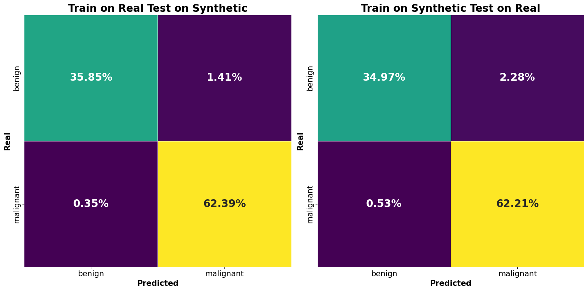
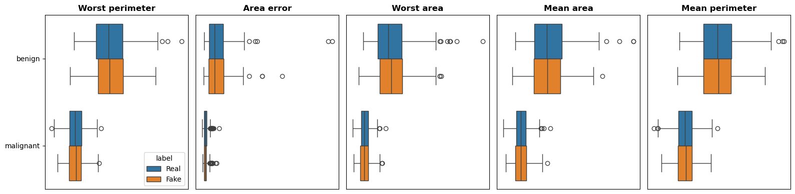
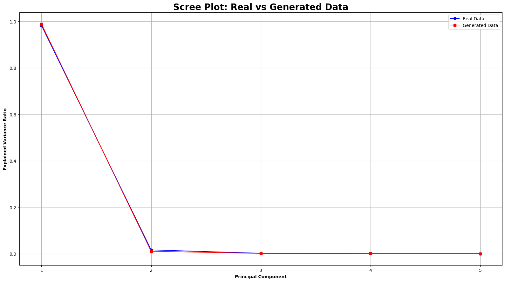
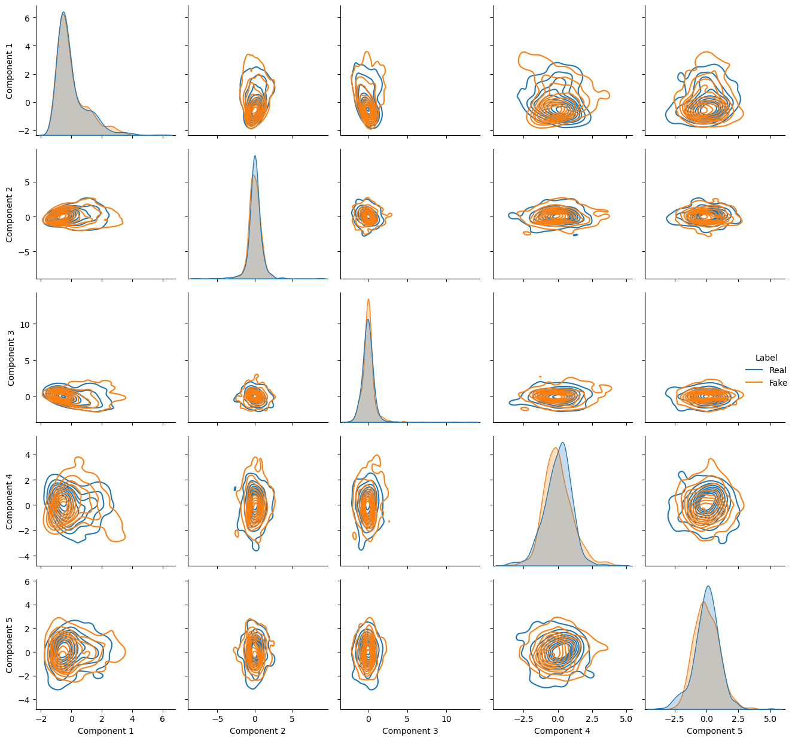

# Breast Cancer Tabular Data Generation
This project is the first of two sections related to the generation of **synthetic medical data** for applications in **Machine Learning** and **Data Science**. The generation of medical data presents peculiar and delicate critical issues that must be handled with caution.
The goal of this project is to train a **Wasserstein Generative Adversarial Network** (**WGAN**) capable of capturing and reproducing features of the [UCI Machine Learning Breast Cancer](https://archive.ics.uci.edu/dataset/17/breast+cancer+wisconsin+diagnostic) dataset such that the data generated:
- are as similar as possible to the real thing
- are indistinguishable for a classifier trained on the real data (its performance is equal on both datasets)


*Classifier comparison*

---

## Table of Contents
1. [Libraries](#libraries)
2. [Data Preparation](#data-preparation)
3. [Data Modeling](#Data-Modeling)
4. [Explicit Evaluation](#Explicit-Evaluation)
5. [Latent Evaluation](#Latent-Evaluation)
6. [Installation](#installation)
7. [Usage](#usage)
8. [Results](#results)
9. [Conclusion](#conclusion)
10. [References](#references)


---

## Libraries
The project uses the following Python libraries:
- **PyTorch** for model implementation.
- **Pandas**/**NumPy** for data manipulation.
- **Scikit-learn** for metrics and preprocessing.
- **Matplotlib**/**Seaborn** for visualization.
- **SciPy** for statistical tests (Kolmogorov-Smirnov, Wasserstein distance).

```python
import pandas as pd
import numpy as np
from scipy import stats
import matplotlib.pyplot as plt
import seaborn as sns
import torch
```

---

## Data Preparation

The dataset contains 10 features related to cancer cell measurements:
1. **Radius**: value of the average distance from the center to the points on the core perimeter.
2. **Texture**: variation of intensity in adjacent pixels.
3. **Perimeter**: total length of the core contour.
4. **Area**: area occupied by the cell nucleus.
5. **Complexity**: uniformity of the contours of the nucleus.
6. **Compacteness**: relationship between area and perimeter of the core.
7. **Concavity**: gravity of indentations along the perimeter of the core.
8. **Number of concavities**: number of concave points along the core boundary.
9. **Symmetry**: similarity between the two halves of the core.
10. **Fractal Dimension**: measure of the complexity of the shape of the core based on the fractal dimension.

**`Mean`**, **`standard deviation`**, and **`worst measure`** are reported for each feature.
Of the 569 measurements 357 are of **benign** tumors and 212 of **malignant** tumors.

The entire dataset was loaded and preprocessed:
- numerical features were scaled between **`[-1, 1]`** to promote model convergence via the **`hyperbolic tangent`** function.
- class **labels were encoded** and provided to the model to condition the generated data.

---

## Data Modeling

The two models of the **WGAN** were created following the best practices of the case and seeking some consistency with the number of instances in the dataset `(17070)`:
- **Generator**: `23.646k` parameters
- **Critic**: `26.753k` parameters

In this way we were able to:
- **adequately capture** the complex and interconnected features of the dataset
- **avoid overfitting** by having slightly more parameters than the number of cases
- **obtain quality gradients** due to a more powerful generator critic

The **Kolomonorv-Smirnov test** was used to evaluate the null hypothesis that the distributions of each real and synthetic feature were from the same population and the **Wasserstein distance** to calculate the mathematical distance between each real-fact pair of distributions:
- **KS test**: for obi feature recreated the null hypothesis was not refutable, all features generated come from the same population as the real ones.
- **W distance**: for 5 features the distance from the corresponding real distributions was found to be greater than 1.

| Feature       | W Distance    |
|--------------|--------|
| **mean perimeter** | 1.236084   |
| **worst perimeter** | 1.615902 |
| **area error** | 2.506679   |
| **mean area** | 16.915316   |
| **worst area** | 29.057681   |

These features relate to characteristics that can be technically derived through the geometric formulas of the circumference and area of the circle. Through empirical tests, an attempt was made to have the model generate the `Δ` between the actual and theoretical values obtained by approximating each cell to a circle: the results were not promising so a more classical approach was preferred. Nevertheless, through a graphical analysis the critical features seem to adequately trace the distributions of the actuals.


*Critic features boxplots*

Although only **84%** of the dataset was adequately recreated the global and class-specific linear relationships were adequately reproduced:

| Correlation       | Mean Absolute Difference    |
|-------------------|-----------------------------|
| **Full Overall**  | 0.0423    |
| **Full Benign**  | 0.0587    |
| **Full Malignant**  | 0.0482    |
| **Critic Overall**  | 0.0156    |
| **Critic Benign**  | 0.0183    |
| **Critic Malignant**  | 0.0646    |

---

## Explicit Evaluation

Through a simulation of an operational context, i.e., the generation of 1000 datasets, the model was evaluated in its ability to adequately reflect reality in the absence of seeds for reproducibility: 
- for all datasets the null hypothesis of the **KS test** was not rejected for any feature
- the number of features with **Wasserstein distance** greater than 1 remained consistent across generations with a slight downward trend

| Number of feature | Number of Datasets|
|-------------------|-------------------|
| 4                 | 25                |
| 5                 | 974                |
| 6                 | 1                |


To asses the quality of the data, the **Train on Real Test on Synthetic (TOR-TS)**  and **Train on Synthetic Test on Real (TOS-TR)** protocol was used:
- a real and synthetic dataset were divided into **train (80%), validation (10%) and test (10%) sets.**
- two binary, `12.354k` parameters classifiers via 128-case batches were trained on the two respective datasets showing acceptable performance, defined by both **accuracy**, **precision**, **recall** and **F1** and a **False Negative rate** as low as possible on the test set.
- finally, both models were tested on the entire dataset not used for their training showing, once again, acceptable performance


*TOR-TS confusion matrix (on the left), TOS-TR confusion matrix (on the right)*

**While the performance is adequate, the real-world impact of the False Negative rate should never be underestimated: errors of this kind can potentially lead to underestimation. The data, even if of excellent quality, and the conclusions reached by any model must always be backed up by a human decision.**

---

## Latent Evaluation

Since the dataste is very complex, an analysis of not only explicit but also latent similarity was necessary, carried out through **Principal Component Analysis**, a dimensional reduction technique that linearly combines real variables into latent components.

### Explained Variance
The variance explained by the real and synthetic components appears to be virtually the same, especially for the former components, which in both datasets explain almost all of the variance.

| Real EV | Fake EV |
|---------|---------|
| 0.982045| 0.988461|
| 0.016176| 0.010266|
| 0.001558| 0.001033|
| 0.000121| 0.000139|
| 0.000088| 0.000085|

### Cosine Distance
The cosine distance between each pair of components was calculated to check their alignment in space: the first components are more closely aligned suggesting greater similarity.
| Component | Cosine Distance |
|-----------|---------|
| 1         | 0.0000  |
| 2         | 0.0014  |
| 3         | 0.0030  |
| 4         | 1.9169  |
| 5         | 1.9158  |

### Wasserstein Distance
Once again, the prince tool confirmed to us the similarity between real and synthetic data.
| Component | Wasserstein Distance |
|-----------|---------|
| 1         | 0.049311  |
| 2         | 0.131439  |
| 3         | 0.082486  |
| 4         | 0.174529  |
| 5         | 0.135763  |

### Screeplot
Through the screeplot we see how the real and synthetic components are almost completely overlapping.

*Components' Screeplot*

### Bivariate KDE plot
The bivariate KDE plot also shows good overlap for the first components, indicating good data quality at the latent level.

*Bivaraite KDE*

---

## Installation

To use this script, follow the steps below:

1. **Clone the repository**  
   Open the terminal and clone the GitHub repository with the command:

   ```bash
   git clone https://github.com/Sim98B/TabularDataGeneration.git
   cd TabularDataGeneration/BrestCancer/Model
   ```
2. **Install requirements**
   
    ```bash
    pip install -r requirements.txt
    ```
---

## Usage

To generate a synthetic dataset based on the Breast Cancer dataset, use the following command:

```bash
python GenerateBreastCancerData.py --weights BCWGAN_weights.pth --scaler min_max_scaler.pkl
```

### Required Arguments:
- `--weights`: Path to the generator weights file (`.pth`).
- `--scaler`: Path to the saved scaler file (`.pkl`).
