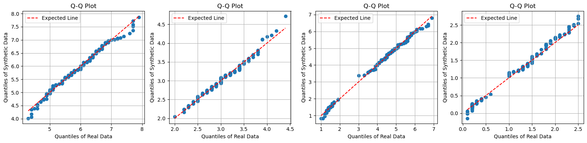
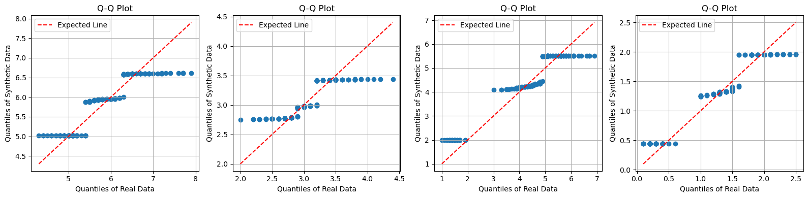
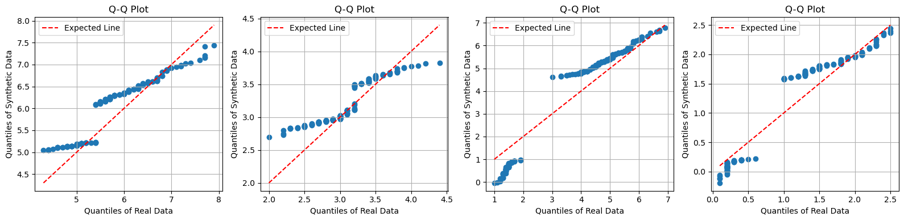

# Iris Tabular Data Generation using PyTorch

This project explores synthetic data generation for the Iris dataset using different architectures for data generation including **Variational Auto Encoder (VAE)**, **Generative Adversarial Network (GAN)** and **Wasserstein GAN WGAN**. The goal is to generate high-quality synthetic tabular data that preserves the statistical properties and class-specific relationships of the original dataset. This work is part of a larger initiative to generate synthetic medical data (tabular and imaging) and is a validation of a protocol to be followed in data generation tasks.


*Example of synthetic vs real data distributions.*

---

## Table of Contents
1. [Libraries](#libraries)
2. [Data Preparation](#data-preparation)
3. [Exploring Architectures](#exploring-architectures)
4. [Optimizing Architecture](#optimizing-architecture)
5. [Wasserstein Conditional GAN](#introducing-the-wgan)
6. [Data Augmentation](#data-augmentation)
7. [Final Evaluation](#final-evaluation)
8. [Installation](#installation)
9. [Usage](#usage)
10. [Results](#results)
11. [Conclusion](#conclusion)
12. [References](#references)

---

## Libraries
The project uses the following Python libraries:
- **PyTorch** for model implementation.
- **Pandas**/**NumPy** for data manipulation.
- **Scikit-learn** for metrics and preprocessing.
- **Matplotlib**/**Seaborn** for visualization.
- **SciPy** for statistical tests (Kolmogorov-Smirnov, Wasserstein distance).

```python
import pandas as pd
import numpy as np
from scipy import stats
import matplotlib.pyplot as plt
import seaborn as sns
import torch
```

---

## Data Preparation
The Iris dataset is loaded and preprocessed:
- **Normalization**: Features scaled to [0, 1].
- **Class Conditioning**: Labels encoded and provided as input to generators.

---

## Exploring Architectures
### GAN vs VAE
Two architectures were compared:
1. **Variational Autoencoder (VAE)**: Learned latent representations but struggled with class-specific feature relationships.
2. **Generative Adversarial Network (GAN)**: Outperformed VAE in capturing feature characteristics as shown by images.

| AVG Metric       | GAN    | VAE    |
|--------------|--------|--------|
| Wasserstein ↓| 0.32274   | 0.25224   |
| KS Test p-value ↑ | 0.00053 | 2.5e-6 |


*Simple VAE Q-Q plots for each features.*

*Simple GAN Q-Q plots for each features.*

---

## Optimizing Architecture
### Conditional GAN (cGAN)
- **Grid Search**:
  - **Noise Vector Size**: Tested [2, 4, 8, 16, 32, 64]. Optimal: **16** (lowest Wasserstein distance).
  - **Network Size**: Small, Medium, Large. Optimal: **Medium**.

|           | Small     | Medium    | Big       |
|-----------|-----------|-----------|-----------|
| 2      | 0.797k      | 3.069k      |  11.709k        |
| 4      | 0.861k     | 3.197k      |       11.965k    |
| 8      | 0.989k       | 3.453k      |      12.477k     |
| 16      | 1.245k       | 3.965k      |    13.501k       |
| 32      | 1.757k       | 4.989k      |        15.549k   |
| 64      | 2.781k       | 7.037k      |     19.645k      |

**Number of parameters o each explored model**

|  Mean Absolute Correlations Differences      |Medium GAN with 16 Noise Vector | Big GAN with 16 Noise Vector |
|-----------|-----------|-----------|
|Overall | 0.0788 | 0.0682 |
| Setosa | 0.1294 | 0.4591|
| Versicolor |0.1593|0.4322|
| Virginica |0.2694|0.2571|

---

## Introducing the WGAN

The **Wasserstein GAN (WGAN)** with gradient penalty improved stability and feature fidelity:
- **Critic Updates**: 5 critic steps per generator step.
- **Gradient Penalty**: λ = 10.

---

## Data Augmentation
To improve the class-specific performance of the WGAN, two new features were created using those in the original dataset.

$$ \text{Sepal Area} \rightarrow \text{Sepal Length} \times \text{Sepal Width} $$

$$ \text{Petal Area} \rightarrow \text{Petal Length} \times \text{Petal Width} $$

These features led to the achievement of excellent overall and class-specific performance by bringing all mean absolute differences between correlations to be < 0.1.

| Feature | Wasserstein Distance | Kolmonorov-Smirnov's D | KS p-value |
|---|---|---|---|
|sepal length (cm)|0.064483	|0.060000|	0.951111|
|sepal width (cm)	| 0.042666|0.126667|	0.180395|
|petal length (cm)|	0.062556|0.060000|	0.951111|
|petal width (cm)|	0.061056|0.120000|	0.230782|

---

## Final Evaluation

**Train on Real Test on Synthetic** and **Train on Synthetic Test on Real** protocol was used to assess the quality of the generated data understood as their indistinguishability in the eyes of a well-trained classifier.
- Training of two classifier models, one on the true dataset one on the synthetic dataset.
- Evaluation  using test sets.
- Cross evaluation from the two models.

