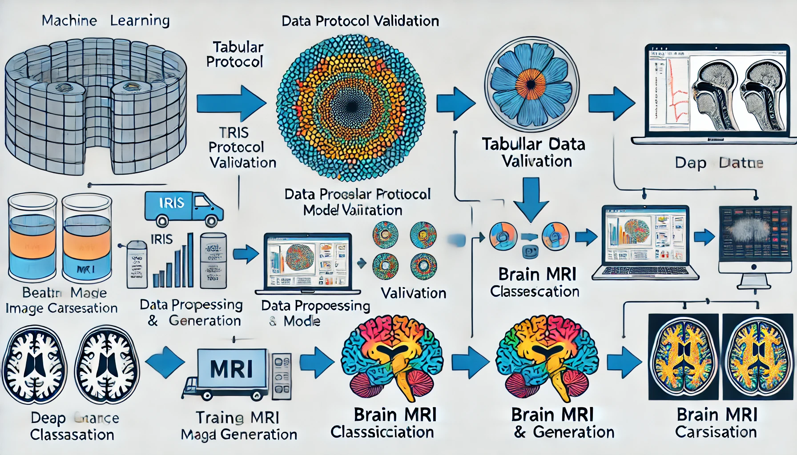

# Tabular and Image Data Generation Project

This repository contains multiple sub-projects aimed at generating synthetic data for different domains, including tabular datasets and medical imaging.

## Project Structure

- **[Iris Protocol Validation](IrisProtocolValidation)**  
  Validation of a generative model for tabular data using the Iris dataset.
  
- **[Breast Cancer Data Generation](BreastCancerDataGeneration/README.md)**  
  Synthetic data generation for breast cancer classification models.
  
- **[Brain Tumor Image Generation](BrainTumorGeneration/README.md)**  
  A generative model for producing synthetic MRI scans classified into healthy and three tumor types.
